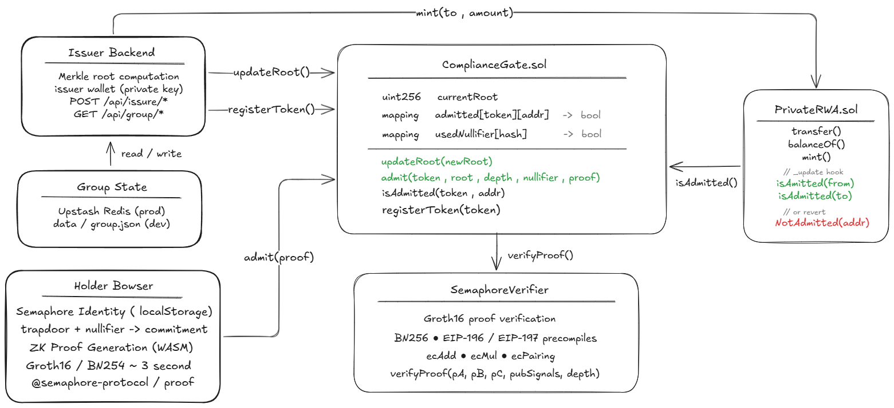

# ZK-RWA Allowlist — "The investor list stays private. Compliance stays on-chain."

The missing privacy layer for institutional RWA tokens on HashKey Chain.

**Demo Video:** [link]
**Live App:** [link]
**GitHub:** [link]

---

## The Problem

Institutional RWA tokens — tokenized bonds, funds, real estate — use **ERC-3643 (T-REX)** as the compliance standard. It works. But it has one critical flaw that blocks institutional adoption:

> **The entire investor list is public.**

Anyone can query the on-chain identity registry and enumerate every whitelisted holder — wallets, balances, and all.

For family offices and institutional LPs, this isn't a minor inconvenience. It's a dealbreaker.

| What gets exposed | Who exploits it |
|---|---|
| Full LP list | Competitor funds front-run your allocations |
| All whitelisted wallets | Journalists publish your investor roster |
| Holder addresses | Social engineering targets become trivial |

---

## The Solution

Keep the allowlist **off-chain**. Prove membership with **zero-knowledge proofs**. Enforce compliance **on-chain**.

The issuer stores KYC-verified identity commitments in a Semaphore group — off-chain, private. Only a 32-byte Merkle root is published on-chain. Holders self-admit by generating a ZK proof in their browser. The contract verifies the proof and records the address — **with no link to which identity they are**.

Every subsequent transfer is a standard ERC-20 check. No per-transaction proof. No overhead.

---

## Architecture

---

## How It Works

**Step 1 — Off-Chain Group**
The issuer collects KYC'd identity commitments. The full list never touches the blockchain — stored in Upstash Redis (production) or local JSON (dev).

**Step 2 — Publish Root**
One transaction: `ComplianceGate.updateRoot(merkleRoot)`. A single hash goes on-chain. The investor list stays invisible.

**Step 3 — Self-Admission** *(once per holder per token)*
The holder generates a Groth16 ZK proof in their browser (~3 seconds, WASM). Submits `admit(token, proof)`. Contract verifies via the stock Semaphore verifier — records the address. **No link to their identity is ever revealed.**

**Step 4 — Compliant Transfer** *(every trade, zero proof cost)*
Standard `transfer()`. The `_update` hook checks `isAdmitted(from) && isAdmitted(to)`. Non-admitted recipient → `revert NotAdmitted(addr)`.

---

## Three Primitives

### ComplianceGate.sol

The compliance core. Stores the Merkle root with a 16-slot rolling history — handles race conditions between proof generation and root updates. Verifies Semaphore Groth16 proofs on-chain using BN254 pairing precompiles (EIP-196/197), verified live on HashKey Chain.

Deployed: `0x920EEDB0A5A6F7766c4bB134ABaF8d855527cB11`

---

### In-Browser ZK Admission

Zero custom circuits. The entire ZK layer uses **Semaphore v4** — an audited, production-grade anonymous signalling protocol by PSE. Proof generation runs entirely client-side via WASM in ~3 seconds.

The `Admitted` event on-chain contains only a nullifier hash. No commitment. No group index. Nothing an observer can trace back to an identity.

---

### ERC-20 Compliance Hook

`PrivateRWA.sol` is a standard OpenZeppelin ERC-20 extended with one hook. Every transfer — including mints — runs through `ComplianceGate.isAdmitted()`. Non-admitted transfers revert with a custom error. Compliance is enforced by the contract itself, not by an off-chain monitor.

---

## Privacy Comparison

| | ERC-3643 | ZK-RWA Allowlist |
|---|---|---|
| Full investor list | **Public** | **Private** |
| Identity ↔ address link | Exposed | Unlinkable |
| Competitor can enumerate holders | Yes | No |
| On-chain compliance enforcement | Yes | Yes |
| Per-transfer proof overhead | None | None |
| Custom ZK circuits | — | **Zero** |

---

## Live on HashKey Chain Testnet

| Contract | Address |
|---|---|
| ComplianceGate | `0x920EEDB0A5A6F7766c4bB134ABaF8d855527cB11` |
| PrivateRWA (HKGB30) | `0xE2453101d1f34EA5D92195DE0056c200A15AaE8F` |

BN254 pairing precompiles (`ecAdd`, `ecMul`, `ecPairing`) verified on Chain ID 133 before building.

---

## Tech Stack

| | |
|---|---|
| Smart Contracts | Solidity 0.8.24, Foundry, OpenZeppelin |
| ZK Protocol | Semaphore v4 — zero custom circuits |
| Proving | In-browser WASM, Groth16 / BN254 |
| Frontend & API | Next.js 14, TypeScript, viem |
| Group Store | Upstash Redis (prod) / local JSON (dev) |
| Chain | HashKey Chain Testnet — Chain ID 133 |
