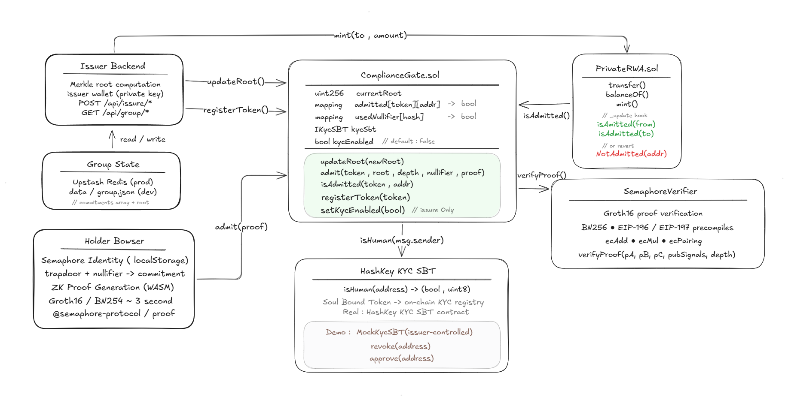
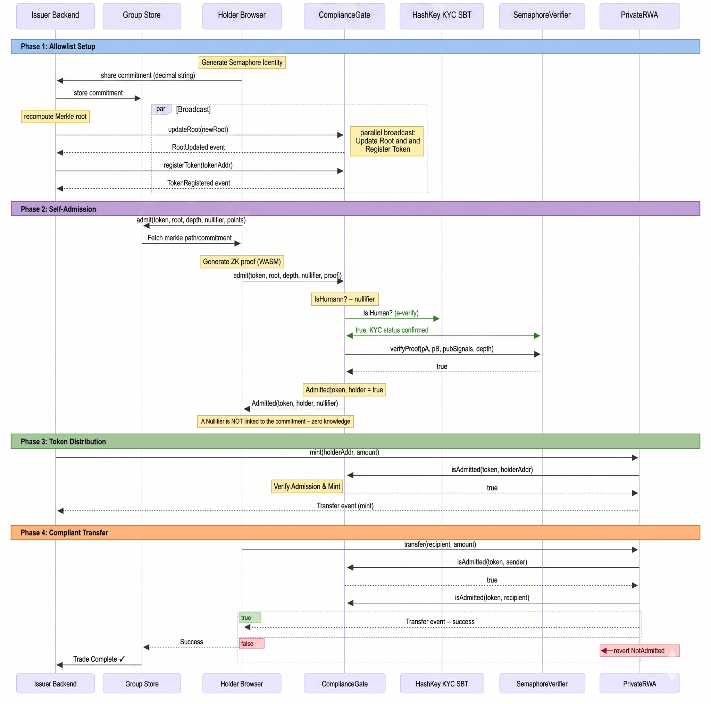
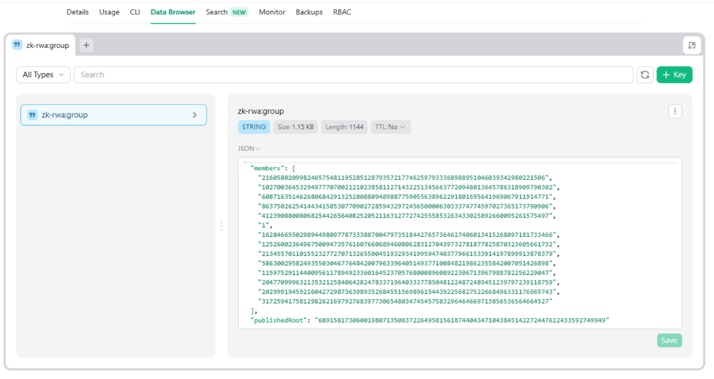
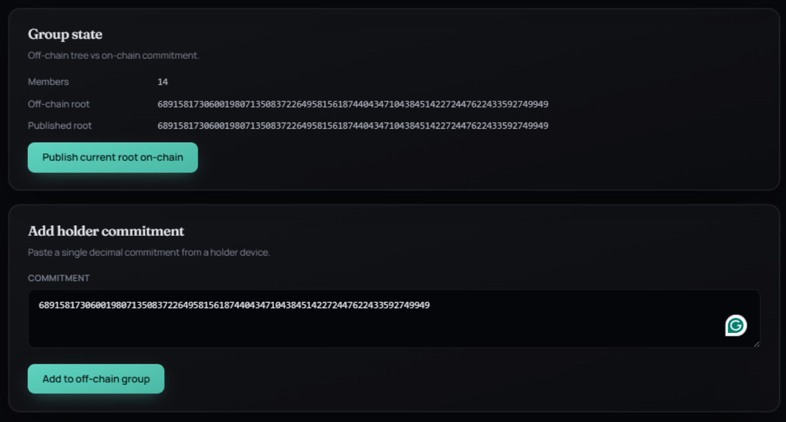
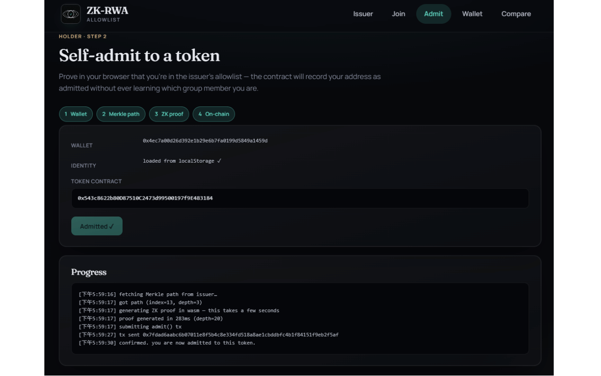
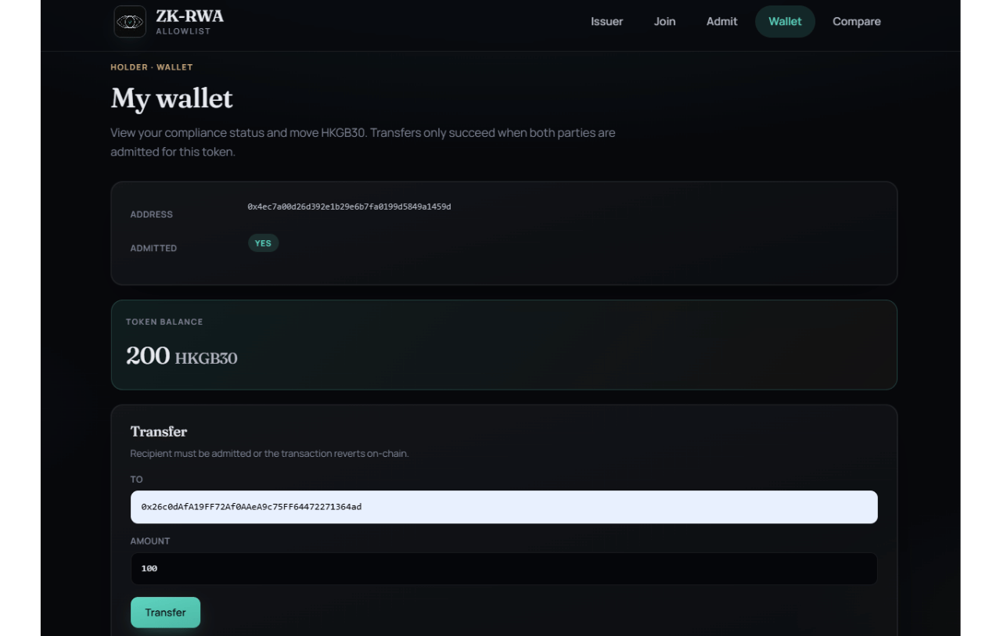

<p align="center">
  
</p>

<h1 align="center">NULLGATE</h1>

<p align="center">
  <strong>The investor list stays private. Compliance stays on-chain.</strong><br>
  Privacy-preserving compliance for institutional RWA tokens on HashKey Chain
</p>

<p align="center">
  <a href="#the-problem">Problem</a> &nbsp;·&nbsp;
  <a href="#solution">Solution</a> &nbsp;·&nbsp;
  <a href="#architecture">Architecture</a> &nbsp;·&nbsp;
  <a href="#hashkey-kyc-integration">HashKey KYC</a> &nbsp;·&nbsp;
  <a href="#getting-started">Getting Started</a> &nbsp;·&nbsp;
  <a href="#demo-flow">Demo</a>
</p>

---

## The Problem

**ERC-3643 (T-REX)** is the de-facto standard for permissioned RWA tokens — tokenized bonds, funds, real estate. It enforces holder KYC through an on-chain identity registry, but that registry is **fully public**: anyone can enumerate every whitelisted investor by reading contract state or scanning `IdentityRegistered` events.

For family offices, qualified investors, and institutional LPs, this is a **non-starter**:

| Threat | Impact |
| --- | --- |
| Competitor reconnaissance | Front-run LP allocation by watching registry additions |
| Journalist enumeration | Publish full investor list from publicly indexed events |
| Social engineering | Target high-net-worth holders identified on-chain |

> **The institutional ask is simple**: _"Don't leak my LP list."_ ERC-3643 does exactly that.

---

## Solution

NULLGATE replaces the public on-chain registry with a **zero-knowledge proof of group membership**.

The issuer's holder list stays **off-chain** as a [Semaphore v4](https://docs.semaphore.pse.dev) group. Only the **Merkle root** — a 32-byte cryptographic fingerprint — is published on-chain. Holders self-admit by generating a ZK proof in the browser proving they belong to the group. The contract records `admitted[token][address] = true` without ever learning _which_ identity commitment maps to _which_ address.

### ERC-3643 vs NULLGATE

<p align="center">
  
</p>

| | ERC-3643 | NULLGATE |
| --- | --- | --- |
| Investor list visibility | **Public** — events + storage | **Private** — off-chain group |
| Identity ↔ address link | Direct on-chain mapping | Unlinkable (ZK proof) |
| Competitor front-running | LP list exposed | Hidden |
| Transfer compliance | On-chain gating | On-chain gating |
| Per-transfer overhead | None | None (one-time admission) |
| Custom ZK circuits | N/A | **Zero** — Semaphore v4 |

---

## Architecture

<p align="center">
  
</p>

### Contracts

**`ComplianceGate.sol`** — the compliance core:
- Maintains a rolling history of the last 16 Merkle roots (handles race between proof generation and root updates)
- Verifies Semaphore Groth16 proofs via `SemaphoreVerifier` (bn254 pairing precompile)
- Nullifier scoping: `scope = hash(tokenAddress)` — same group member can admit to multiple tokens independently
- Message binding: `message = hash(msg.sender)` — proof is cryptographically bound to the calling address
- Integrates **HashKey KYC SBT** via the `IKycSBT` interface

**`PrivateRWA.sol`** — a minimal ERC-20 with compliance hook:
- `_update` hook calls `gate.isAdmitted()` for both sender and recipient on every transfer
- Mints skip the sender check (`from == address(0)`), burns skip the recipient check
- Issuer-only `mint()` function for token distribution

**`MockKycSBT.sol`** — demo-only KYC contract:
- Implements the same `IKycSBT` interface as the real HashKey KYC SBT
- Issuer can approve/revoke any address for demo purposes
- Drop-in replaceable with the real HashKey KYC SBT contract in production

### Deployed Contracts (HashKey Chain Testnet — chainId 133)

| Contract | Address |
| --- | --- |
| SemaphoreVerifier | `0x…` |
| ComplianceGate | `0x305299D47Aedf7Ab66dd43e4B0eBBC8A09365eb5` |
| PrivateRWA (ZKCB) | `0x543c8622b80D87510C2473d99500197f9E483184` |
| MockKycSBT | `0x16e7c5a64FEB42A3328dC9D40fdB17DafA98D141` |

### ZK Component

**Zero custom circuits.** The entire ZK layer uses [Semaphore v4](https://docs.semaphore.pse.dev) — an audited, production-grade protocol for anonymous group membership proofs built on bn254 (Groth16). Proof generation happens entirely in the browser via WASM (~3 seconds). No trusted setup required by the project — Semaphore's trusted setup is reused.

---

## How It Works

<p align="center">
  
</p>

### Step-by-Step

**1 — Issuer builds the private allowlist**

The issuer collects Semaphore identity commitments from KYC'd investors off-chain. Commitments are Poseidon hashes of EdDSA public keys — they contain no personal data and cannot be linked to wallet addresses. The full list is stored off-chain.

**2 — Publish Merkle root on-chain**

<p align="center">
  
</p>

The issuer calls `updateRoot(merkleRoot)` to publish a 32-byte commitment to the current group state. This is the only group-related data that ever touches the blockchain.

<p align="center">
  
</p>

**3 — Holder self-admits via ZK proof**

The holder generates a Groth16 proof in their browser proving:
- Their identity commitment is a leaf in the current Merkle tree (group membership)
- Their wallet address is bound to this specific proof (message binding)
- A unique nullifier is derived to prevent double-admission

<p align="center">
  
</p>

The `admit()` transaction writes `admitted[token][holder] = true` on-chain. The link between the commitment and the wallet address is never revealed.

**4 — Compliant transfer**

<p align="center">
  
</p>

Every ERC-20 transfer triggers the `_update` hook in `PrivateRWA.sol`. Both sender and recipient must be admitted. Non-admitted recipients cause an immediate on-chain revert with `NotAdmitted(address)`.

### Privacy Model

| Property | Visibility | Reason |
| --- | --- | --- |
| Full allowlist of identity commitments | **Private** | Stored off-chain in issuer backend only |
| Which commitment maps to which address | **Private** | ZK proof reveals nothing beyond membership |
| Set of admitted addresses | Public | Required for transfer hook |
| Individual token holdings | Public | Standard ERC-20 |

> **Trade-off**: This is _allowlist-level_ privacy, not transaction-level privacy. Stealth addresses and shielded pools are out of scope — the institutional ask is "don't leak my LP list", not "hide my transactions".

---

## HashKey KYC Integration

NULLGATE integrates with **HashKey KYC SBT** — HashKey Chain's on-chain identity verification — as an optional second factor on top of the ZK membership proof.

### Dual-layer admission

```
admit() checks (in order):
  1. ZK proof of group membership   ← proves "issuer approved this identity"
  2. HashKey KYC SBT (if enabled)   ← proves "this wallet has passed KYC"
```

Both checks must pass for admission to succeed. Either check alone is insufficient.

### IKycSBT Interface

```solidity
interface IKycSBT {
    function isHuman(address account) external view returns (bool, uint8);
}
```

Both the real HashKey KYC SBT and `MockKycSBT.sol` implement this interface. Switching from demo to production requires only changing the constructor address — no contract redeployment of `ComplianceGate`.

### Demo vs Production

| | Demo (MockKycSBT) | Production (HashKey KYC SBT) |
| --- | --- | --- |
| KYC provider | Issuer dashboard (simulate) | HashKey Exchange (SFC-licensed) |
| Verification | `approve(address)` call | Real KYC document review |
| Contract address | `MockKycSBT.sol` | HashKey KYC SBT (mainnet) |
| `kycEnabled` default | `false` (safe for demo) | `true` |

The `kycEnabled` flag allows the issuer to toggle KYC requirement without redeployment — useful for demo environments and phased rollouts.

---

## Tech Stack

| Layer | Technology |
| --- | --- |
| Smart contracts | Solidity 0.8.24, Foundry, OpenZeppelin ERC-20 |
| ZK protocol | Semaphore v4.14 (`@semaphore-protocol/contracts`) |
| Client-side proving | `@semaphore-protocol/{identity,group,proof}` (in-browser WASM, Groth16) |
| Frontend / Backend | Next.js 14 (App Router), TypeScript, viem |
| KYC | HashKey KYC SBT (`IKycSBT` interface) + MockKycSBT for demo |
| Group storage | Upstash Redis (production) / `data/group.json` (local dev) |
| Chain | HashKey Chain Testnet (chainId 133) |

---

## Repository Structure

```
contracts/
  src/
    ComplianceGate.sol     Merkle root registry + ZK-proof admission + KYC gate
    PrivateRWA.sol         ERC-20 with compliance hook
    MockKycSBT.sol         Demo KYC contract (IKycSBT interface)
  test/
    ComplianceGate.t.sol   Foundry unit tests
  script/
    Deploy.s.sol           One-shot deployment script
lib/
  semaphore/
    group.ts               Server-side group management (Redis / JSON dual-backend)
    identity.ts            Browser-side identity generation + localStorage persistence
    proof.ts               Browser-side ZK proof generation (depth-20 Groth16)
  chain/
    abi.ts                 Contract ABIs (ComplianceGate, PrivateRWA, MockKycSBT)
    config.ts              Chain config + deployed addresses
    browserClient.ts       viem browser client (wallet interaction)
    issuerClient.ts        viem server client (issuer transactions)
app/
  page.tsx                 Landing page
  join/page.tsx            Holder: create Semaphore identity + display commitment
  admit/page.tsx           Holder: generate ZK proof + submit admission
  wallet/page.tsx          Holder: balance + transfer
  issuer/page.tsx          Issuer: group management + KYC dashboard + minting
  compare/page.tsx         ERC-3643 vs NULLGATE side-by-side analysis
  api/
    group/root/            GET current off-chain Merkle root
    group/merkle-path/     GET Merkle path for a commitment
    issuer/add-member/     POST add commitment to off-chain group
    issuer/publish-root/   POST publish Merkle root on-chain
    issuer/mint/           POST mint tokens to admitted address
    issuer/toggle-kyc/     POST enable/disable KYC requirement
    issuer/approve-kyc/    POST approve/revoke address in MockKycSBT
    issuer/seed-redis/     POST migrate local group.json to Redis
asset/
  RWA-zk.png               Architecture diagram
  flow2.png                Full flow diagram
  Comparsion.png           ERC-3643 vs NULLGATE comparison
data/
  group.json               Issuer-side Semaphore group state (local dev fallback)
```

---

## Getting Started

### Prerequisites

- Node.js 18+
- [Foundry](https://book.getfoundry.sh/getting-started/installation)
- A wallet with HSK testnet tokens ([faucet](https://testnet.hsk.xyz))

### Install

```bash
npm install
cd contracts && forge install && cd ..
```

### Contract Tests

```bash
cd contracts && forge test -vv
```

### Deploy Contracts

```bash
cp .env.example .env
# Edit .env — set ISSUER_PRIVATE_KEY (fund with HSK first)

cd contracts
forge script script/Deploy.s.sol --rpc-url $HASHKEY_TESTNET_RPC --broadcast

# Copy the four printed addresses into .env:
#   NEXT_PUBLIC_COMPLIANCE_GATE_ADDRESS=0x...
#   NEXT_PUBLIC_PRIVATE_RWA_ADDRESS=0x...
#   NEXT_PUBLIC_MOCK_KYC_SBT_ADDRESS=0x...
#   NEXT_PUBLIC_ISSUER_ADDRESS=0x...
```

### Run the App

```bash
npm run dev
```

Open [http://localhost:3000](http://localhost:3000).

---

## Demo Flow

**1. Generate identity** (`/join`)
> Holder creates a Semaphore identity in-browser. The private key stays in localStorage — only the commitment (a Poseidon hash) is ever shared.

**2. Issuer onboards the holder** (`/issuer`)
> Issuer pastes the commitment → adds to off-chain group → publishes new Merkle root on-chain via `updateRoot()`.

**3. KYC gate demo** (`/issuer` + `/admit`)
> With KYC enabled and the wallet not yet approved, the `admit()` transaction reverts with `NotKYCVerified`. Issuer approves the wallet via the MockKycSBT dashboard.

**4. Self-admission** (`/admit`)
> Holder generates a Groth16 proof in-browser (~3s) and submits `admit()`. On-chain: `Admitted` event emitted, `admitted[ZKCB][wallet] = true`. No link between commitment and wallet is ever revealed.

**5. Token distribution** (`/issuer`)
> Issuer mints ZKCB tokens to the admitted holder address.

**6. Compliant transfer** (`/wallet`)
> Transfer to a second admitted address → ✅ succeeds.  
> Transfer to a non-admitted address → ❌ reverts with `NotAdmitted`.

---

## Deploying to Vercel

1. Push to GitHub and import the repo in Vercel.
2. Add all environment variables from `.env.example` in the Vercel dashboard.
3. Create a free [Upstash Redis](https://upstash.com) database and add:
   - `UPSTASH_REDIS_REST_URL`
   - `UPSTASH_REDIS_REST_TOKEN`
4. After the first deploy, call `POST /api/issuer/seed-redis` once to migrate existing group data to Redis.

> The app auto-detects the backend: Redis when `UPSTASH_REDIS_REST_URL` is set, `data/group.json` otherwise.

---

## Scope & Limitations

This is a prototype demonstrating the core primitive. Explicit scope cuts:

- **No transaction-level privacy** — no shielded pool or stealth addresses; admitted addresses are public
- **Single issuer** — one hardcoded issuer wallet; multi-tenant issuer support is future work
- **No identity revocation** — a commitment can be excluded from a future root update, but previously admitted wallets remain admitted; on-chain revocation is future work
- **No ERC-3643 conformance** — intentionally an alternative model, not an extension
- **Centralized issuer** — the off-chain group is managed by a single party; migrating to multi-sig or DAO governance is a natural next step

---

## License

MIT
